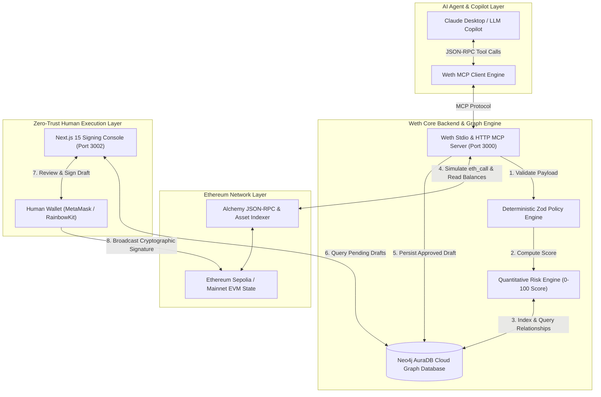
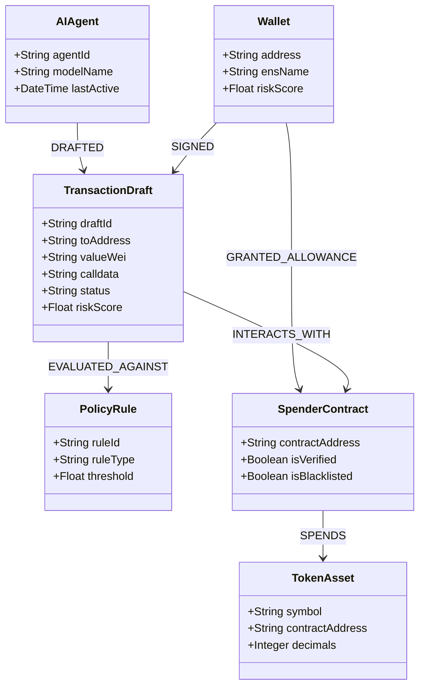
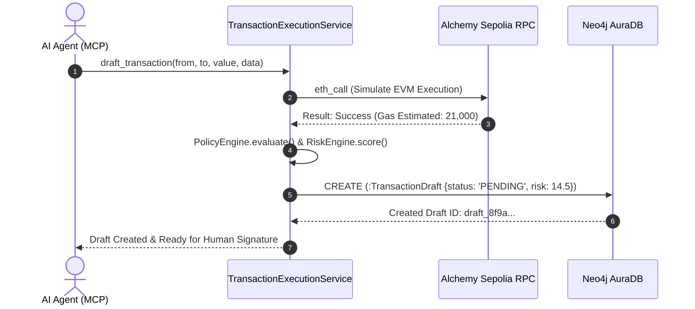
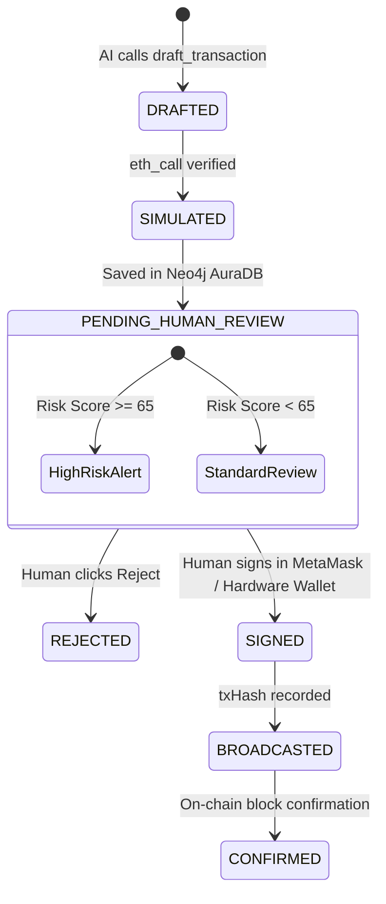

# Weth — Master Technical Documentation & Architecture Reference

> **Version:** 1.1.0  
> **Classification:** Technical Architecture & System Specification  
> **Primary Track:** Developer Tools & Software Infrastructure | AI x Web3 | Institutional DeFi Security  
> **Graph Engine:** Neo4j AuraDB Cloud  

---

## Table of Contents

1. [Executive Summary & Core Philosophy](#1-executive-summary--core-philosophy)
2. [End-to-End System Architecture](#2-end-to-end-system-architecture)
   - [2.1 High-Level System Topology](#21-high-level-system-topology)
   - [2.2 Monorepo Architecture & Package Hierarchy](#22-monorepo-architecture--package-hierarchy)
3. [Neo4j AuraDB Graph Database Security Model](#3-neo4j-auradb-graph-database-security-model)
   - [3.1 Graph Schema Overview (Nodes & Relationships)](#31-graph-schema-overview-nodes--relationships)
   - [3.2 Multi-Hop Threat & Drain Detection](#32-multi-hop-threat--drain-detection)
   - [3.3 Core Security Cypher Queries](#33-core-security-cypher-queries)
4. [Model Context Protocol (MCP) Layer](#4-model-context-protocol-mcp-layer)
   - [4.1 Why MCP Replaces Raw JSON-RPC](#41-why-mcp-replaces-raw-json-rpc)
   - [4.2 Complete MCP Tool Specification (13 Tools)](#42-complete-mcp-tool-specification-13-tools)
   - [4.3 Claude Desktop & Agent Configuration](#43-claude-desktop--agent-configuration)
5. [Policy Engine & Quantitative Risk Engine](#5-policy-engine--quantitative-risk-engine)
   - [5.1 Deterministic Zod Policy Enforcement](#51-deterministic-zod-policy-enforcement)
   - [5.2 0–100 Quantitative Risk Scoring Algorithm](#52-0100-quantitative-risk-scoring-algorithm)
   - [5.3 Allowance & Portfolio Analyzer Pipeline](#53-allowance--portfolio-analyzer-pipeline)
6. [Blockchain Execution & Simulation Layer](#6-blockchain-execution--simulation-layer)
   - [6.1 EVM State Simulation (`eth_call`)](#61-evm-state-simulation-eth_call)
   - [6.2 Gas Estimation & Priority Fee Calculation](#62-gas-estimation--priority-fee-calculation)
   - [6.3 ENS Resolution Engine](#63-ens-resolution-engine)
7. [Zero-Trust Human Execution Console (`apps/web`)](#7-zero-trust-human-execution-console-appsweb)
   - [7.1 Human-in-the-Loop Review State Machine](#71-human-in-the-loop-review-state-machine)
   - [7.2 Non-Custodial Cryptographic Signing](#72-non-custodial-cryptographic-signing)
8. [RESTful API Specification (`apps/api`)](#8-restful-api-specification-appsapi)
9. [Security Threat Model & Attack Mitigation Matrix](#9-security-threat-model--attack-mitigation-matrix)
10. [Local Development, Environment Variables & Deployment](#10-local-development-environment-variables--deployment)

---

## 1. Executive Summary & Core Philosophy

**Weth** is an institutional-grade infrastructure layer designed to connect Large Language Models (LLMs) and autonomous AI agents with Ethereum decentralized finance without exposing private keys to non-deterministic systems.

### The Problem
When autonomous AI agents interact with blockchain networks, they face three severe failure modes:
1. **Private Key Compromise:** Giving AI models direct control over private keys creates vulnerability to prompt injection, model hallucination, and third-party API leaks.
2. **Brittle Calldata Generation:** Prompting LLMs to generate hex-encoded EVM transaction calldata directly results in malformed transactions, improper gas limits, or loss of funds.
3. **Relational Blindspots:** Traditional SQL relational tables struggle to trace complex multi-hop interactions between wallet addresses, ERC20 spending allowances, proxy contracts, and policy violations across time.

### The Weth Solution
Weth separates **AI Autonomous Reasoning (Read/Simulate/Draft)** from **Human Cryptographic Execution (Review/Sign/Broadcast)**:
- **AI Agents** interact exclusively via standardized **Model Context Protocol (MCP)** tools to read state, simulate transactions against live EVM forks, and propose structured transaction drafts.
- **Neo4j AuraDB** indexes the relationships between wallets, spender contracts, drafted intents, and security policies as a unified directed property graph.
- **Human Operators** review AI-generated transaction drafts inside a Next.js 15 Web Dashboard (`apps/web`) and sign verified payloads cryptographically using MetaMask or hardware wallets.

---

## 2. End-to-End System Architecture

### 2.1 High-Level System Topology



### 2.2 Monorepo Architecture & Package Hierarchy

Weth is structured as a modern pnpm workspace monorepo enforcing strict boundary isolation across packages:

```
weth/
├── apps/
│   ├── landing/          # Next.js 16 Landing Page (Port 3001) with Interactive Showcase
│   ├── web/              # Next.js 16 Signing Console & Web Dashboard (Port 3002)
│   ├── api/              # Express REST API Backend Server (Port 3000)
│   └── mcp-server/       # Model Context Protocol (MCP) Server for AI Agent Integration
├── packages/
│   ├── blockchain/       # EVM Client, Gas Simulator, ENS Resolver & Alchemy Services
│   ├── database/         # Neo4j AuraDB Graph Engine Client, Schemas & Lineage Queries
│   └── shared/           # PolicyEngine, RiskEngine, Portfolio & Allowance Analyzers
├── docs/                 # Specialized Markdown Documentation Suite
└── DOCUMENTATION.md      # Master System Architecture Book (This Document)
```

---

## 3. Neo4j AuraDB Graph Database Security Model

Weth utilizes **Neo4j AuraDB Cloud** as its primary database. In decentralized finance security, financial exposure is defined by *connections*—who has permission to spend whose tokens, which AI agent proposed which transaction, and which policy rule triggered an alert.

### 3.1 Graph Schema Overview (Nodes & Relationships)



### 3.2 Multi-Hop Threat & Drain Detection

A traditional relational database requires slow, complex recursive table joins to detect whether a wallet has granted an allowance to a spender contract that is interacting with an unverified or high-risk implementation.

With Neo4j AuraDB, Weth performs instantaneous multi-hop graph traversals to detect:
- **Circular Allowance Exposure:** `(:Wallet)-[:GRANTED_ALLOWANCE]->(:SpenderContract)-[:CALLS]->(:UnverifiedProxy)`
- **Anomalous Spender Frequency:** Spender contracts receiving unusual volumes of approvals within short time intervals.
- **AI Drafting Lineage:** Complete historical traceability of every prompt and draft from `(:AIAgent)` through `(:TransactionDraft)` down to the cryptographic `(:Signature)`.

### 3.3 Core Security Cypher Queries

#### Query 1: Detect Risky Unlimited Allowances for a Wallet
```cypher
MATCH (w:Wallet {address: $walletAddress})-r:GRANTED_ALLOWANCE->(s:SpenderContract)
WHERE r.amount = "UNLIMITED" OR s.isVerified = false OR s.isBlacklisted = true
RETURN s.contractAddress AS Spender, s.isVerified AS Verified, r.amount AS Allowance, s.isBlacklisted AS Blacklisted
```

#### Query 2: Trace End-to-End Lineage of a Pending Transaction Draft
```cypher
MATCH (a:AIAgent)-[:DRAFTED]->(t:TransactionDraft {draftId: $draftId})
OPTIONAL MATCH (t)-[:EVALUATED_AGAINST]->(p:PolicyRule)
OPTIONAL MATCH (t)-[:TARGETS]->(c:SpenderContract)
RETURN a.agentId, t.valueWei, t.riskScore, collect(p.ruleId) AS TriggeredPolicies, c.isVerified
```

---

## 4. Model Context Protocol (MCP) Layer

### 4.1 Why MCP Replaces Raw JSON-RPC

When an LLM attempts raw JSON-RPC calls, it frequently produces malformed JSON strings or incorrect hexcalldata formatting. Weth exposes Ethereum infrastructure through the **Model Context Protocol (MCP)** SDK v1.0.0, providing strict, self-describing **Zod JSON Schemas** directly to the model's tool-calling interface.

### 4.2 Complete MCP Tool Specification (13 Tools)

| Tool Identifier | Category | Input Schema (Zod) | Description & Output |
| :--- | :--- | :--- | :--- |
| `alchemy_getTokenBalances` | Read State | `{ address: string }` | Returns native ETH balance and all ERC20 token balances with decimal conversions. |
| `alchemy_getAssetTransfers` | Read State | `{ address: string, maxCount?: number }` | Retrieves historical incoming and outgoing transfer histories from Alchemy Indexer. |
| `resolve_ens` | Read State | `{ ensNameOrAddress: string }` | Resolves a `.eth` name to a `0x` hex address or performs reverse resolution. |
| `get_gas_price` | Read State | `{}` | Returns live Ethereum base fee per gas and max priority fee per gas in Gwei. |
| `simulate_transaction` | Simulation | `{ from: string, to: string, value?: string, data?: string }` | Runs `eth_call` state simulation against live EVM state; returns execution status and estimated gas. |
| `estimate_gas` | Simulation | `{ from: string, to: string, value?: string, data?: string }` | Returns precise gas limit units required for a transaction payload. |
| `detect_risky_approvals` | Security | `{ walletAddress: string }` | Queries Neo4j AuraDB for open ERC20 allowances granted to unverified or blacklisted spenders. |
| `analyze_portfolio_risk` | Security | `{ address: string }` | Computes portfolio concentration index (HHI) and asset volatility risk scores. |
| `evaluate_policy` | Guardrails | `{ draftPayload: TransactionDraftSchema }` | Validates transaction draft against deterministic Zod policy rules (max spend, whitelist/blacklist). |
| `calculate_risk_score` | Guardrails | `{ draftPayload: TransactionDraftSchema }` | Computes quantitative 0–100 risk score and returns detailed risk factor breakdown. |
| `draft_transaction` | Action | `{ from: string, to: string, value: string, data?: string, description: string }` | Simulates, scores, and saves a verified transaction draft into Neo4j AuraDB for human review. |
| `list_pending_transactions` | Action | `{ walletAddress: string }` | Lists all pending transaction drafts currently awaiting human cryptographic signature. |
| `get_transaction_status` | Action | `{ txHashOrDraftId: string }` | Checks whether a draft is pending, signed, broadcasted, or confirmed on-chain. |

### 4.3 Claude Desktop & Agent Configuration

To connect Weth's MCP Server to Claude Desktop or compatible AI agent runners, add the following entry to your `claude_desktop_config.json`:

```json
{
  "mcpServers": {
    "weth-wallet-mcp": {
      "command": "node",
      "args": ["/absolute/path/to/weth/apps/mcp-server/dist/index.js"],
      "env": {
        "NEO4J_URI": "neo4j+s://xxxxxx.databases.neo4j.io",
        "NEO4J_USERNAME": "neo4j",
        "NEO4J_PASSWORD": "your-neo4j-password",
        "ALCHEMY_API_KEY": "your-alchemy-sepolia-key"
      }
    }
  }
}
```

---

## 5. Policy Engine & Quantitative Risk Engine

Weth's security layer resides in `packages/shared`, ensuring identical deterministic validation across the API, MCP Server, and Frontend Console.

### 5.1 Deterministic Zod Policy Enforcement (`PolicyEngine`)

Before any draft is saved to Neo4j AuraDB, `PolicyEngine.evaluate(tx)` inspects:
1. **Maximum Value Threshold:** Automatically rejects or flags transfers exceeding predefined ETH/ERC20 limits.
2. **Contract Blacklist Screening:** Blocks transactions targeting flagged malicious addresses.
3. **Calldata Validation:** Verifies four-byte function selectors against safe standard interfaces (`transfer`, `approve`).

### 5.2 0–100 Quantitative Risk Scoring Algorithm (`RiskEngine`)

Every transaction draft is assigned a composite risk score from `0` (Institutional Safe) to `100` (Critical Danger):

$$\text{RiskScore} = \min\left(100, \, W_{\text{val}} \cdot S_{\text{val}} + W_{\text{gas}} \cdot S_{\text{gas}} + W_{\text{reputation}} \cdot S_{\text{rep}} + W_{\text{allowance}} \cdot S_{\text{allow}}\right)$$

- **`0 – 24` (LOW RISK):** Standard transfer to verified recipient or known protocol.
- **`25 – 64` (MEDIUM RISK):** Large volume transfer or interaction with newly deployed contract.
- **`65 – 100` (CRITICAL / BLOCKED):** Unlimited token approval requested, target contract flagged in Neo4j graph, or gas anomaly detected.

---

## 6. Blockchain Execution & Simulation Layer

Located in `packages/blockchain`, this layer manages all EVM network interactions over Ethereum Sepolia testnet and Ethereum mainnet.



---

## 7. Zero-Trust Human Execution Console (`apps/web`)

The Next.js 16 Web Dashboard (`apps/web` on port `3002`) provides a human-in-the-loop cryptographic signing console.

### 7.1 Human-in-the-Loop Review State Machine



### 7.2 Non-Custodial Cryptographic Signing

1. The user connects their browser wallet via **RainbowKit / Wagmi v3**.
2. The user selects a pending draft from the dashboard table.
3. The console displays the simulated EVM state changes, gas estimate, and quantitative risk factors.
4. When approved, Wagmi invokes `sendTransaction()` in the user's browser wallet, broadcasting the signature directly from the user's secure keystore.

---

## 8. RESTful API Specification (`apps/api`)

The Express backend (`apps/api` on port `3000`) provides standard HTTP endpoints for external integrations and frontend telemetry:

| Method | Endpoint | Description |
| :--- | :--- | :--- |
| `GET` | `/api/health` | Returns service health, Neo4j AuraDB connectivity status, and EVM network latency. |
| `GET` | `/api/wallet/:address/balance` | Returns native ETH and indexed ERC20 balances for any address. |
| `GET` | `/api/wallet/:address/approvals` | Queries Neo4j AuraDB for all active token spending allowances. |
| `GET` | `/api/transactions/pending` | Lists all pending transaction drafts awaiting human signature. |
| `POST` | `/api/transactions/draft` | Creates and simulates a new transaction draft. |
| `POST` | `/api/transactions/:draftId/sign` | Records a broadcasted transaction hash for an approved draft. |

---

## 9. Security Threat Model & Attack Mitigation Matrix

| Threat / Attack Vector | Risk Level | Weth Mitigation Mechanism |
| :--- | :--- | :--- |
| **LLM Prompt Injection Drain** | Critical | AI agents do not hold private keys; even if compromised, they can only create unexecuted drafts requiring human signature. |
| **Malformed Calldata Hallucination** | High | Every draft undergoes deterministic `eth_call` simulation; failing payloads are rejected before draft persistence. |
| **Unlimited Allowance Exploits** | High | Neo4j AuraDB graph queries flag any requested allowance exceeding safety thresholds or targeting unverified spenders. |
| **Malicious Spender Proxy Swaps** | Medium | `detect_risky_approvals` traces multi-hop spender relationships across the graph database. |
| **Gas Spike / Griefing Attack** | Medium | `RiskEngine` calculates gas consumption ratios and elevates risk scores if gas estimates exceed standard limits. |

---

## 10. Local Development, Environment Variables & Deployment

### 10.1 Required Environment Variables (`.env`)

Create a `.env` file at the root of the workspace:

```env
# Neo4j AuraDB Cloud Configuration
NEO4J_URI=neo4j+s://xxxxxx.databases.neo4j.io
NEO4J_USERNAME=neo4j
NEO4J_PASSWORD=your_super_secret_neo4j_password

# Alchemy Ethereum Sepolia / Mainnet RPC
ALCHEMY_API_KEY=your_alchemy_api_key
RPC_URL=https://eth-sepolia.g.alchemy.com/v2/your_alchemy_api_key

# Application Ports
PORT=3000
NEXT_PUBLIC_API_URL=http://localhost:3000
```

### 10.2 Monorepo Build & Development Workflow

```bash
# Install all workspace packages
pnpm install

# Build all TypeScript packages (blockchain, database, shared)
pnpm build

# Run unit and integration tests across the workspace
pnpm test

# Launch local development environment
pnpm dev
```

---

*Weth — Zero-Trust AI Agent Execution Infrastructure built for the future of decentralized finance.*
