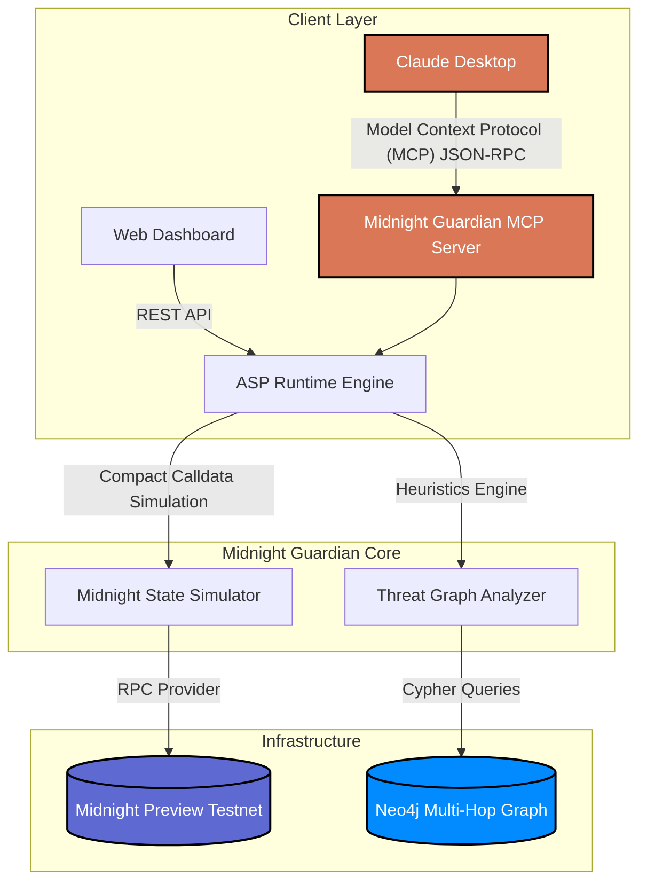

<div align="center">
  

  <h1>Midnight Guardian 🌌</h1>
  <p><strong>Deterministic Pre-Sign Verification & AI Security Copilot for the Midnight Network.</strong></p>

  <p>
    <a href="https://midnight.network/"></a>
    <a href="https://modelcontextprotocol.io/"></a>
    <a href="https://neo4j.com/"></a>
    <a href="https://nextjs.org/"></a>
  </p>
</div>

## ⚠️ The Problem: Blind Signing in Web3
The UX of transaction signing is broken. Users are routinely forced to sign opaque hexadecimal calldata, interacting with unverified contracts, and unknowingly granting unlimited approvals to malicious actors. Existing tools are reactive—they track stolen funds *after* the fact.

## 🛡️ The Solution: Midnight Guardian
**Midnight Guardian** is a highly technical, zero-knowledge threat-prevention layer built natively for the **Midnight Network**. It leverages the Model Context Protocol (MCP) to turn AI assistants (like Claude) into deterministic blockchain security auditors. 

Before a user ever clicks "Sign", Midnight Guardian:
1. **Simulates state transitions** via Midnight's `compact_call` sandbox.
2. **Evaluates Zero-Knowledge constraints** to ensure invariants hold true.
3. **Traverses a multi-hop Neo4j threat graph** to detect phishing, proxy masking, and unlimited approval heuristics.

> **Hackathon Track Integration:** Midnight is not just an add-on; it is the absolute core of our architecture. We utilize Midnight's privacy-preserving capabilities and the Compact compiler to run private, secure, and zero-knowledge simulations of smart contracts prior to network propagation.

---

## 📐 System Architecture

Our platform is engineered as a precision instrument, separating the deterministic ZK simulation runtime from the conversational AI interface.



### Core Components
1. **Model Context Protocol (MCP) Server**: A standard-compliant server that allows Claude to execute `audit_wallet` and `simulate_transaction` commands deterministically.
2. **ASP (Active Security Posture) Runtime Engine**: The backend orchestrator that validates requests and manages local cache state.
3. **Midnight State Simulator**: Integrates with the `@midnight-ntwrk/midnight-js` SDK to sandbox evaluate Compact smart contracts.
4. **Neo4j Threat Graph**: An advanced graph database that maps interactions, detecting multi-hop laundering clusters and unverified proxy delegations in real-time.

---

## 🚀 Key Features

- **Zero-Knowledge State Simulation**: Evaluates Midnight contract calldata before broadcasting. Ensures that all ZK constraints and data privacy requirements are met perfectly.
- **AI-Driven Threat Intelligence**: Native integration with Claude Desktop. You can literally ask Claude: *"Is this Midnight address safe to interact with?"* and it will execute a deterministic audit.
- **Micro-Escrow Validation**: Verifies that token transfers (tMID) are routed correctly, safeguarding against man-in-the-middle clipboard injections.
- **Premium Security Dashboard**: A stunning, hardware-accelerated dark-mode dashboard providing real-time telemetry, risk scoring (0-100), and graph alerts.

---

## 🛠️ Technical Implementation

### The `compact_call` Sandbox
We heavily utilize the Midnight Network's underlying capabilities. When a transaction is analyzed, the calldata is routed through our local simulator. If a contract attempts an unbounded authorization or violates expected ledger invariants, the zero-knowledge proof generation is simulated and halted, flagging the exact risk to the user.

### Claude MCP Integration
```json
{
  "mcpServers": {
    "midnight-guardian": {
      "command": "node",
      "args": ["/absolute/path/to/nocturne/apps/mcp-server/dist/index.js"],
      "env": {
        "MIDNIGHT_RPC_URL": "https://rpc.preview.midnight.network",
        "NEO4J_URI": "bolt://localhost:7687"
      }
    }
  }
}
```

---

## 💻 Getting Started (Local Development)

### Prerequisites
- Node.js >= 18.0.0
- pnpm >= 8.0.0
- Claude Desktop App (for MCP integration)
- Midnight Network Wallet (Lace)

### Installation
1. Clone the repository:
```bash
git clone https://github.com/ayushkumar2601/nocturne.git
cd nocturne
```

2. Install dependencies:
```bash
pnpm install
```

3. Setup your environment variables:
```bash
cp .env.example .env
# Add your Midnight Testnet parameters and Neo4j credentials
```

4. Start the development server (Web App + API):
```bash
pnpm dev
```

The stunning security dashboard will be available at `http://localhost:3000`.

---

## 🏆 Hackathon Impact
Midnight Guardian transforms how users interact with the Midnight Network. By acting as an intelligent firewall between the user's wallet and the network, we solve one of Web3's most critical UI/UX problems: blind signing. 

The integration of **Zero-Knowledge privacy** (Midnight) and **Conversational AI** (Claude) creates a paradigm shift in Web3 security—making the decentralized web safe, transparent, and accessible for everyone.

---
*Built with precision for the Midnight Network Hackathon.*
